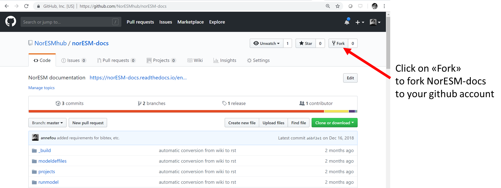
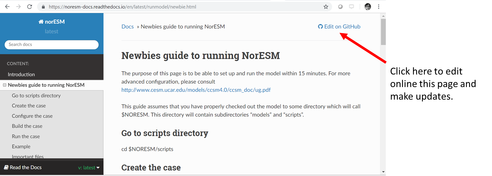
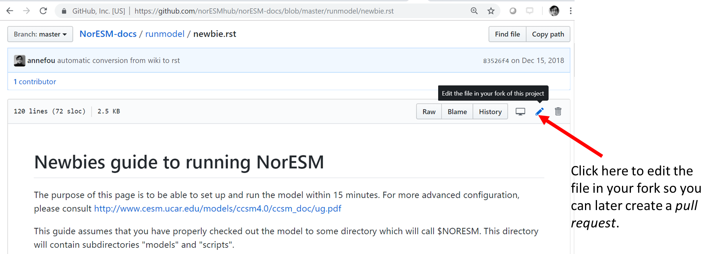
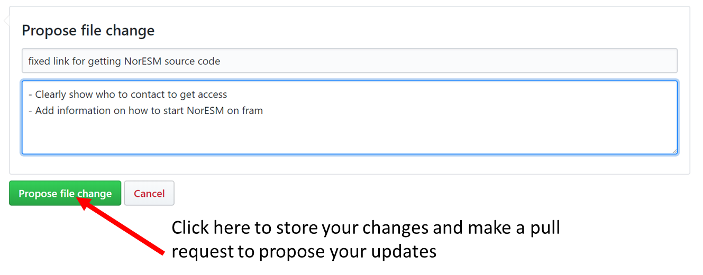
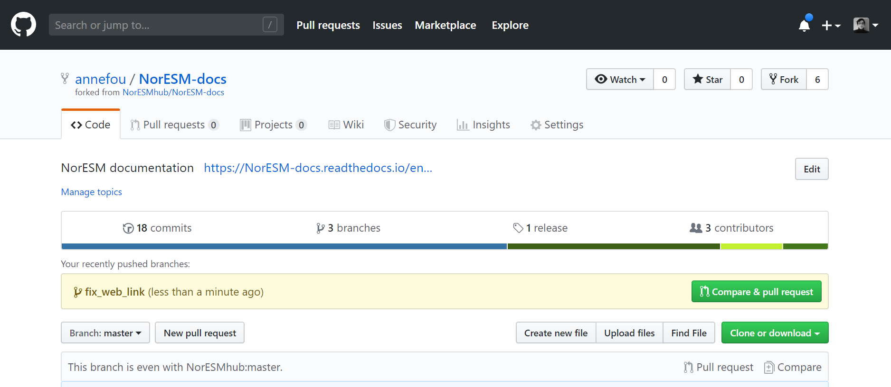
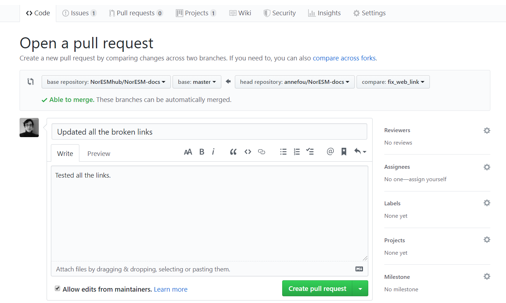

# How to contribute to the NorESM documentation?

You need a [Github account](https://github.com/join) for being able to update the [NorESM documentation](https://noresm-docs.readthedocs.io/en/latest/). Please see [setup](../setup) instructions.

## Initial setup

- [Fork this repository](https://github.com/NorESMhub/NorESM-docs/fork) as shown in the figure below.

This step should be done once only. Then you always use your forked repository to make changes and submit a pull request whenever you wish these changes to be 
added to the NorESM documentation.

## Update norESM documentation online

- Go online to [NorESM documentation](https://noresm-docs.readthedocs.io/en/latest/) and whenever you would like to update the documentation, click on "Edit on GitHub".

- Then click on the "pen" (see image below) and write your text ([reStructuredText](http://docutils.sourceforge.net/docs/user/rst/quickref.html)) 

You can now change the file online. 

> ## Remark
> At the top you should get a message like the one below:
>
> **You’re editing a file in a project you don’t have write access to. Submitting a change to this file will write it to 
> a new branch in your fork USER/NorESM-docs, so you can send a pull request.**
>
> Where USER would be your own github username.
>
{: .callout}

- Save your changes in your forked repository and create a pull request.

> ## Exercice
>
> 
> - Read the [NorESM documentation](https://noresm-docs.readthedocs.io/en/latest/) and make an update to any file (you can edit and change
> anything for this exercise).
> - Suggest your change and create a pull request. 
> - Ask for a review (ask the person sitting next to you).
> - Discuss what happens if your pull request is accepted.
>
{: .challenge}
 
 

## Update NorESM documentation from your local computer

If you do not like to update the documentation online and prefer to use your favorite editor locally on your machine/laptop, you still need
to fork the [NorESM-docs](https://github.com/NorESMhub/NorESM-docs/fork) repository. 

### How substantial will be my changes?

If you plan to make substantial changes to the [NorESM documentation](https://noresm-docs.readthedocs.io/en/latest/); 
for instance, if you are willing to change the structure, add new chapters, etc. it is worth [submitting an issue](https://github.com/NorESMhub/NorESM-docs/issues/new) to explain 
what is your plan before starting any changes. It is a good way to reach a consensus and make sure your changes are later easily accepted 
by the maintainers. 

> ## How to notify maintainers?
> Do not hesitate to ping the maintainers (e.g. add @annefou in the issue) to get a quick answer and start a conversation.
{: .callout}

### Get the forked repository

- Open a Terminal and clone the forked repository:

~~~
git clone https://github.com/USER/NorESM-docs.git
~~~
{: .language-bash}

Where you replace `USER` by your github username. 

> ## Notes
>
> SSH cloning (rather than the HTTPS cloning used above)
>    will also work for those who have set up SSH keys with GitHub.
{: .callout}

- Go into that directory using:

~~~
cd NorESM-docs
~~~
{: .language-bash}

Note that the name of your directory should be what you chose when cloning the repository e.g. on the example this is `NorESM-docs` 
because we did not renamed it when cloning.

- To be able to pull upstream style changes, you should manually add the
     "parent" repository as a remote called `upstream`:

~~~
git remote add upstream https://github.com/NorESMhub/NorESM-docs.git
~~~
{: .language-bash}

This will allow you to pull in changes made to the latest version of the NorESM documentation.
(Note that the user name above is `NorESMhub`, *not* an individual github username,
since you are adding the master copy of the NorESM documentation as a remote.)

- Configure the `upstream` remote to not download tags:

~~~
git config --local remote.upstream.tagOpt --no-tags
~~~
{: .language-bash}

### Make and suggest changes

If you forked this repository earlier, you would first need to update it (both your local copy and remote forked repositorty) 
before starting any new changes. 
Please, read [Synchronize your fork with the parent repository](#synchronize-your-fork-with-the-parent-repository).

- Make local changes

**Never update the master branch**. Create a new branch:

~~~
git checkout -b fix_web_link
~~~
{: .language-bash}

~~~
Switched to a new branch 'fix_web_link'
~~~
{: .output}

The command above create a new branch called `fix_web_link` and directly checkout to this new branch.

You can check your working branch with the following command:

~~~
git branch
~~~
{: .language-bash}

~~~
* fix_web_link
  master
~~~
{: .output}

> ## What branch name should I use?
>
> There is no rule for choosing a branch name but as for choosing filenames/project names, etc., it is recommended to choose meaningful 
> branch names.
{: .callout}

You are now ready to edit any files locally. 

For instance, let's update `start.rst`. Use the editor of your choice and edit the file to make the change of your choice.

Then, make sure you commit your changes locally:

~~~
git add start.rst
~~~
{: .language-bash}

Edit any other files that you would like to include in your next pull request and then commit your changes:

~~~
git commit -m "fixed all the linked in all documents"
~~~
{: .language-bash}

And push your local changes to your remote repository:

~~~
git push origin -u fix_web_link
~~~
{: .language-bash}

> ## Remark
> Note the option `-u` we used to link your local branch to the remote one. 
>
{: .callout}

- Submit pull request for review

Go online to your fork repository and create a new pull request (as suggest at the top). 

Once created, your pull request will be reviewed and if accepted will be merged to the main documentation.

> ## Exercice (optional)
>
> This exercise is meant to be done in pairs. 
> - Read the [NorESM documentation](https://noresm-docs.readthedocs.io/en/latest/) and discuss with your fellow of a possible (small)
> change.
> - [Create an issue](https://github.com/NorESMhub/NorESM-docs/issues/new) in NorESM-docs Github repository to explain your plans
> - Follow the workflow explain above and suggest a change.
>
{: .challenge}
 

### Synchronize your fork with the parent repository

Make sure you are in the `master` branch:

~~~
git checkout master
~~~
{: .language-bash}

Then get the latest version locally:

~~~
git pull upstream master
~~~
{: .language-bash}

You should not get any conflicts because the master branch is never updated in your fork (remember, you need to create a branch 
when you wish to make changes).

Update your remote repository:

~~~
git push origin master
~~~
{: .language-bash}

You are now ready! 

> ## Remark
> Make sure you update your fork repository before creating a new branch an making any changes!
>
{: .callout}



